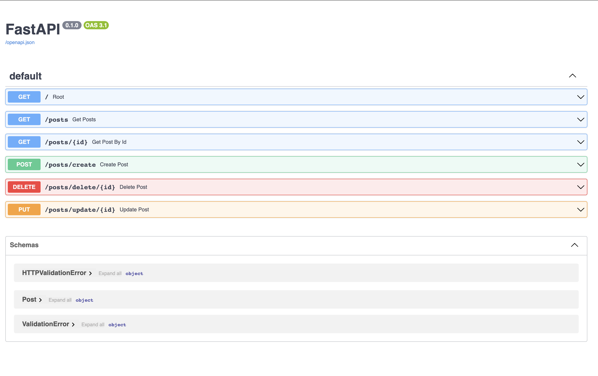

## Python Web API project

In this repo I am learning Web API technology with FASTAPI. \
I am following a beautiful tutorial [here](https://www.youtube.com/watch?v=0sOvCWFmrtA&t=8474s). \
And you can find author's repo [here](https://github.com/Sanjeev-Thiyagarajan/fastapi-course). 

### Run
- I recommend you to use a virtual env to running the project. \
Type ```python3 -m venv <name>``` in your terminal to create an environment. \
Then activate it by this command. ```source <venv_name> bin activate```
- Make sure you have all the modules in the requirements.txt file in your virtual environment \
Type and run ```uvicorn app.main:app --reload``` in the terminal. \
Here is your API is now running in your local environment.


### Documentation

To go documentation there are two ways:
- type /docs after the base url.
- type /redoc after the base url.

### Other Sections are coming soon!
